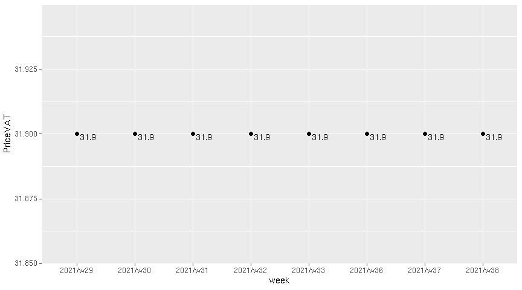
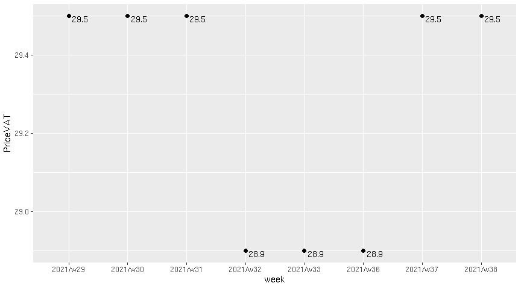
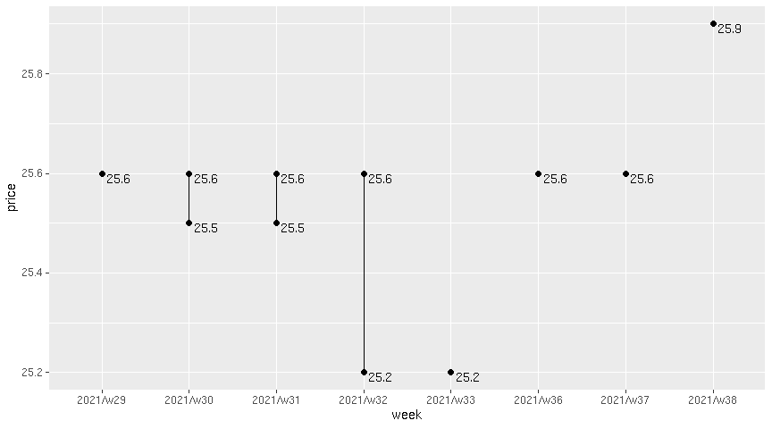
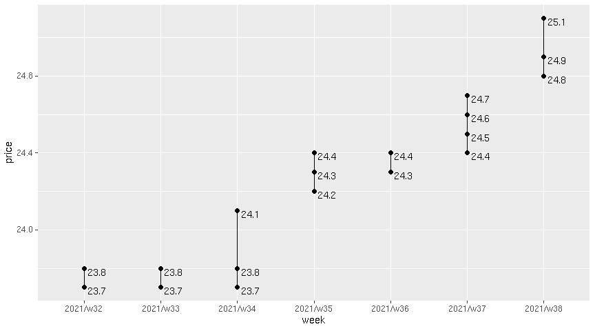
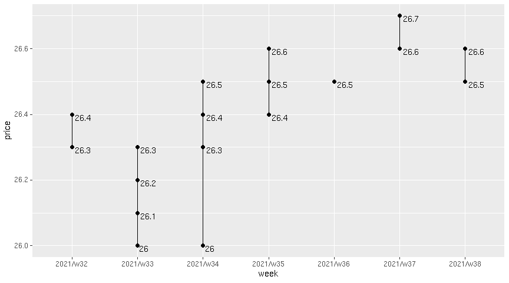

Spot On
================

|    Today’s | This Week |
|-----------:|----------:|
| 2021-09-23 |  2021/w38 |

### Tank Ono

> Gasoline BA95

| vendor  | origin   | week     | date       | day       | fuel      | price | PriceVAT |
|:--------|:---------|:---------|:-----------|:----------|:----------|------:|---------:|
| TankOno | webslurp | 2021/w38 | 2021-09-23 | Thursday  | NATURAL95 | 26.36 |     31.9 |
| TankOno | webslurp | 2021/w38 | 2021-09-22 | Wednesday | NATURAL95 | 26.36 |     31.9 |
| TankOno | webslurp | 2021/w37 | 2021-09-18 | Saturday  | NATURAL95 | 26.36 |     31.9 |
| TankOno | webslurp | 2021/w37 | 2021-09-17 | Friday    | NATURAL95 | 26.36 |     31.9 |
| TankOno | webslurp | 2021/w37 | 2021-09-15 | Wednesday | NATURAL95 | 26.36 |     31.9 |
| TankOno | webslurp | 2021/w37 | 2021-09-14 | Tuesday   | NATURAL95 | 26.36 |     31.9 |
| TankOno | webslurp | 2021/w37 | 2021-09-13 | Monday    | NATURAL95 | 26.36 |     31.9 |

> Diesel

| vendor  | origin   | week     | date       | day       | fuel   | price | PriceVAT |
|:--------|:---------|:---------|:-----------|:----------|:-------|------:|---------:|
| TankOno | webslurp | 2021/w38 | 2021-09-23 | Thursday  | DIESEL | 24.38 |     29.5 |
| TankOno | webslurp | 2021/w38 | 2021-09-22 | Wednesday | DIESEL | 24.38 |     29.5 |
| TankOno | webslurp | 2021/w37 | 2021-09-18 | Saturday  | DIESEL | 24.38 |     29.5 |
| TankOno | webslurp | 2021/w37 | 2021-09-17 | Friday    | DIESEL | 24.38 |     29.5 |
| TankOno | webslurp | 2021/w37 | 2021-09-15 | Wednesday | DIESEL | 24.38 |     29.5 |
| TankOno | webslurp | 2021/w37 | 2021-09-14 | Tuesday   | DIESEL | 24.38 |     29.5 |
| TankOno | webslurp | 2021/w37 | 2021-09-13 | Monday    | DIESEL | 24.38 |     29.5 |

### Axigon

> Diesel

| vendor | origin   | week     | date       | day       | fuel   | price | PriceVAT |
|:-------|:---------|:---------|:-----------|:----------|:-------|------:|---------:|
| AXIGON | webslurp | 2021/w38 | 2021-09-23 | Thursday  | Diesel |  25.9 |     31.4 |
| AXIGON | webslurp | 2021/w38 | 2021-09-22 | Wednesday | Diesel |  25.9 |     31.4 |
| AXIGON | webslurp | 2021/w37 | 2021-09-18 | Saturday  | Diesel |  25.6 |     31.0 |
| AXIGON | webslurp | 2021/w37 | 2021-09-17 | Friday    | Diesel |  25.6 |     31.0 |
| AXIGON | webslurp | 2021/w37 | 2021-09-15 | Wednesday | Diesel |  25.6 |     31.0 |
| AXIGON | webslurp | 2021/w37 | 2021-09-14 | Tuesday   | Diesel |  25.6 |     31.0 |
| AXIGON | webslurp | 2021/w37 | 2021-09-13 | Monday    | Diesel |  25.6 |     31.0 |

### UIC

> Diesel

| vendor | origin  | week     | date       | day       | fuel           | price | priceVAT |
|:-------|:--------|:---------|:-----------|:----------|:---------------|------:|---------:|
| UIC    | web/csv | 2021/w38 | 2021-09-23 | Thursday  | Motorová nafta |  25.1 |     30.4 |
| UIC    | web/csv | 2021/w38 | 2021-09-22 | Wednesday | Motorová nafta |  24.9 |     30.1 |
| UIC    | web/csv | 2021/w38 | 2021-09-21 | Tuesday   | Motorová nafta |  24.8 |     30.0 |
| UIC    | web/csv | 2021/w37 | 2021-09-18 | Saturday  | Motorová nafta |  24.7 |     29.9 |
| UIC    | web/csv | 2021/w37 | 2021-09-17 | Friday    | Motorová nafta |  24.6 |     29.8 |
| UIC    | web/csv | 2021/w37 | 2021-09-16 | Thursday  | Motorová nafta |  24.5 |     29.6 |
| UIC    | web/csv | 2021/w37 | 2021-09-15 | Wednesday | Motorová nafta |  24.4 |     29.5 |
| UIC    | web/csv | 2021/w37 | 2021-09-14 | Tuesday   | Motorová nafta |  24.4 |     29.5 |
| UIC    | web/csv | 2021/w36 | 2021-09-11 | Saturday  | Motorová nafta |  24.3 |     29.4 |
| UIC    | web/csv | 2021/w36 | 2021-09-10 | Friday    | Motorová nafta |  24.4 |     29.5 |
| UIC    | web/csv | 2021/w36 | 2021-09-09 | Thursday  | Motorová nafta |  24.3 |     29.4 |
| UIC    | web/csv | 2021/w36 | 2021-09-08 | Wednesday | Motorová nafta |  24.3 |     29.4 |
| UIC    | web/csv | 2021/w36 | 2021-09-07 | Tuesday   | Motorová nafta |  24.4 |     29.5 |
| UIC    | web/csv | 2021/w35 | 2021-09-04 | Saturday  | Motorová nafta |  24.4 |     29.5 |

> Gasoline BA95

| vendor | origin  | week     | date       | day       | fuel        | price | priceVAT |
|:-------|:--------|:---------|:-----------|:----------|:------------|------:|---------:|
| UIC    | web/csv | 2021/w38 | 2021-09-23 | Thursday  | Benzin BA95 |  26.5 |     32.1 |
| UIC    | web/csv | 2021/w38 | 2021-09-22 | Wednesday | Benzin BA95 |  26.5 |     32.1 |
| UIC    | web/csv | 2021/w38 | 2021-09-21 | Tuesday   | Benzin BA95 |  26.6 |     32.2 |
| UIC    | web/csv | 2021/w37 | 2021-09-18 | Saturday  | Benzin BA95 |  26.6 |     32.2 |
| UIC    | web/csv | 2021/w37 | 2021-09-17 | Friday    | Benzin BA95 |  26.6 |     32.2 |
| UIC    | web/csv | 2021/w37 | 2021-09-16 | Thursday  | Benzin BA95 |  26.7 |     32.3 |
| UIC    | web/csv | 2021/w37 | 2021-09-15 | Wednesday | Benzin BA95 |  26.6 |     32.2 |
| UIC    | web/csv | 2021/w37 | 2021-09-14 | Tuesday   | Benzin BA95 |  26.6 |     32.2 |
| UIC    | web/csv | 2021/w36 | 2021-09-11 | Saturday  | Benzin BA95 |  26.5 |     32.1 |
| UIC    | web/csv | 2021/w36 | 2021-09-10 | Friday    | Benzin BA95 |  26.5 |     32.1 |
| UIC    | web/csv | 2021/w36 | 2021-09-09 | Thursday  | Benzin BA95 |  26.5 |     32.1 |
| UIC    | web/csv | 2021/w36 | 2021-09-08 | Wednesday | Benzin BA95 |  26.5 |     32.1 |
| UIC    | web/csv | 2021/w36 | 2021-09-07 | Tuesday   | Benzin BA95 |  26.5 |     32.1 |
| UIC    | web/csv | 2021/w35 | 2021-09-04 | Saturday  | Benzin BA95 |  26.5 |     32.1 |

